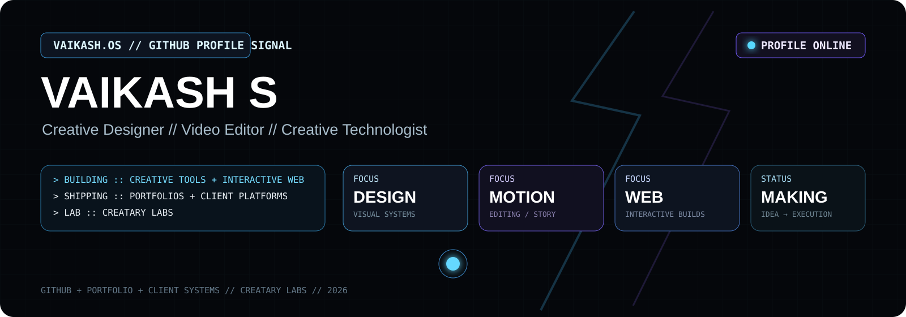
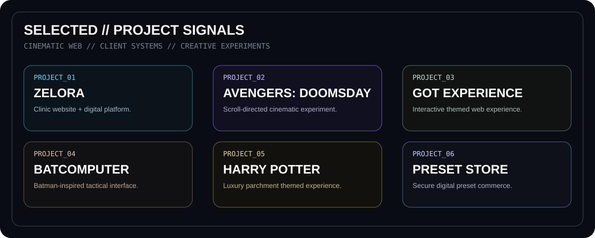
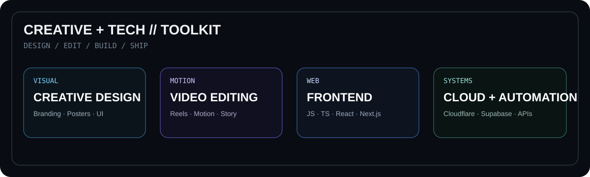

  

  
  
  

  Creative Designer · Video Editor · Creative Technologist

> I build visual systems, cinematic web experiences, client platforms and creative tools. My work sits between design, editing, frontend engineering and product experimentation.

  

## ✦ CURRENT // FOCUS

- Building and refining **Creatary Labs**
- Designing premium client-facing websites and digital experiences
- Exploring cinematic scroll interaction, WebGL and motion-heavy interfaces
- Creating tools and systems around editing, content production and creative operations
- Shipping practical experiments across GitHub and Cloudflare

  

## ✦ SELECTED // PROJECTS

  

| Project | What it is |
|---|---|
| [Zelora](https://github.com/vaikashhari/Zelora-final) | Hair & skin clinic website and digital platform |
| [Avengers: Doomsday](https://github.com/vaikashhari/AVENGERS-DOOMSDAY) | Scroll-directed cinematic web experiment |
| [GOT Experience](https://github.com/vaikashhari/GOT) | Interactive themed web experience |
| [Batcomputer](https://github.com/vaikashhari/Batman-intro) | Batman-inspired tactical interface |
| [Harry Potter](https://github.com/vaikashhari/Harry-Potter) | Luxury parchment-themed experience |
| [Preset Store](https://github.com/vaikashhari/Preset-Website) | Secure digital preset commerce platform |
| [Portfolio](https://github.com/vaikashhari/vaikash-portfolio) | Personal cinematic portfolio and case-study site |

  

## ✦ CREATIVE + TECH // TOOLKIT

  

### Core stack

  
  
  
  
  
  
  
  
  
  

### Creative work

Video editing · Motion design · Social content · Visual design · Brand systems · Interactive web

  

## ✦ PROFILE // SIGNAL

  
  

  

  

## ✦ ABOUT // VAIKASH

I work across creative production and digital product building, combining visual storytelling with hands-on technical execution. My projects range from brand and client work to experimental cinematic interfaces and utility-focused web systems.

For a more complete view of my work:

**Portfolio:** https://vaikash-portfolio.pages.dev/

  

## ✦ CREDITS // PROFILE

  <strong>Vaikash S</strong> 
  Creative Designer · Video Editor · Creative Technologist  
  <strong>Built by Creatary Labs</strong> 
  Design · Edit · Build · Deploy

